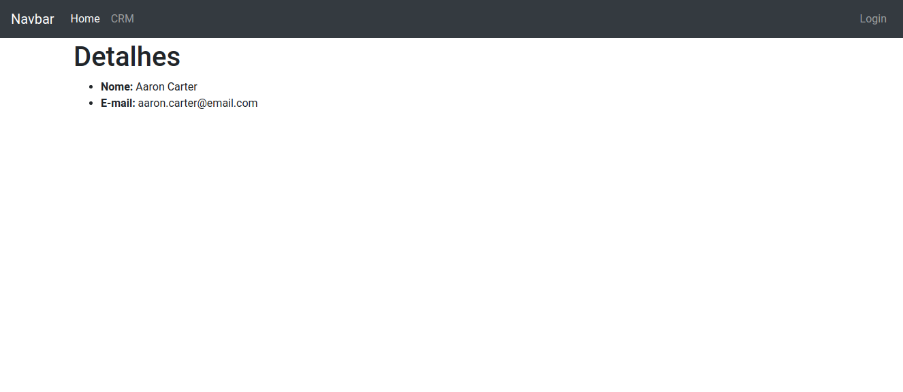

# django-boilerplate

#### Boilerplate to create Django project.

This boilerplate creates a simple Django project with a core app and some pre-defined settings.

The project contains:

* Settings config
* App Accounts
    * login and logout
* App CORE
    * Abstract models
* App CRM
    * CRUD
    * Templates

## Packages

Packages used in conjunction with Django.

* [Python 3.8.9](https://www.python.org/downloads/)
* [Django 3.2](https://www.djangoproject.com/)
* [dj-database-url](https://pypi.org/project/dj-database-url/)
* [django-extensions](https://django-extensions.readthedocs.io/en/latest/installation_instructions.html)
* [django-localflavor](https://pypi.org/project/django-localflavor/)
* [isort](https://pypi.org/project/isort/)
* [python-decouple](https://pypi.org/project/python-decouple/)


## Usage

This script run in **Unix**.

```
git clone https://github.com/rg3915/django-boilerplate.git /tmp/django-boilerplate
# Copy this file to your actual folder.
cp /tmp/django-boilerplate/boilerplatesimple.sh .
```

Update USERNAME to your username.

Type the following command. You can change the project name.

```
source boilerplatesimple.sh myproject
```


### Alias

If yout want to use a alias.

```
alias djboilerplate='git clone https://github.com/rg3915/django-boilerplate.git /tmp/django-boilerplate;
cp /tmp/django-boilerplate/boilerplatesimple.sh .
printf "Type:\n`tput setaf 2`source boilerplatesimple.sh myproject\n"'
```

### App CRM

CRM is initially without migrations. Giving you the freedom to delete the app.
However, if you want to use it, enter the following commands:

```
python manage.py makemigrations
python manage.py migrate
python manage.py create_data
python manage.py runserver
```

### New app

If create new app edit `*/apps.py`.


```python
# accounts/apps.py
# core/apps.py
# crm/apps.py
name = 'PROJECT.<app name>'
# example
name = 'myproject.accounts'
name = 'myproject.core'
name = 'myproject.crm'
```

### Base Models

The app core contains abstract models to use in other models.


### management commands

The app core contains a management commands example.

```
$ python manage.py hello --help

usage: manage.py hello [-h] [--awards] ...

Print hello world.

optional arguments:
  -h, --help            show this help message and exit
  --awards, -a          Help of awards options.
```

```
$ python manage.py create_data --help

usage: manage.py create_data [-h] ...

Create data.
```

## Screen





### Folders

```
.
├── manage.py
├── myproject
│   ├── asgi.py
│   ├── accounts
│   │   ├── admin.py
│   │   ├── apps.py
│   │   ├── models.py
│   │   ├── tests.py
│   │   ├── urls.py
│   │   └── views.py
│   ├── core
│   │   ├── admin.py
│   │   ├── apps.py
│   │   ├── management
│   │   │   └── commands
│   │   │       ├── create_data.py
│   │   │       ├── hello.py
│   │   │       └── __init__.py
│   │   ├── models.py
│   │   ├── tests.py
│   │   ├── urls.py
│   │   └── views.py
│   ├── crm
│   │   ├── admin.py
│   │   ├── apps.py
│   │   ├── forms.py
│   │   ├── models.py
│   │   ├── tests.py
│   │   ├── urls.py
│   │   └── views.py
│   ├── settings.py
│   ├── urls.py
│   └── wsgi.py
├── README.md
└── requirements.txt
```

## Read

https://github.com/rg3915/django-auth-tutorial

https://github.com/rg3915/django-custom-login-email

https://github.com/rg3915/coreui-django-boilerplate-v2
