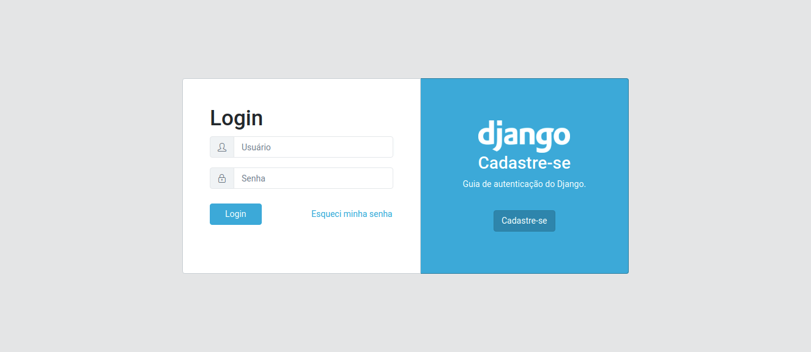
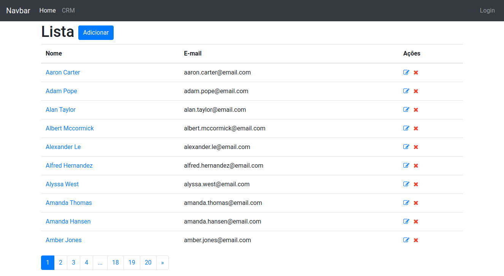
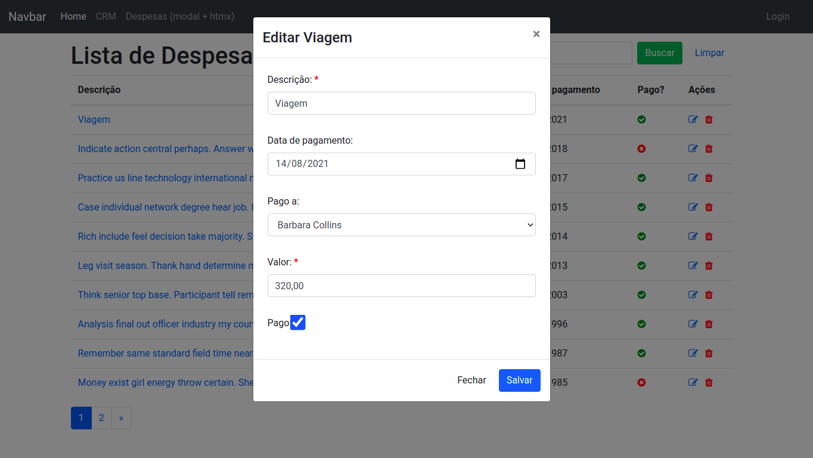
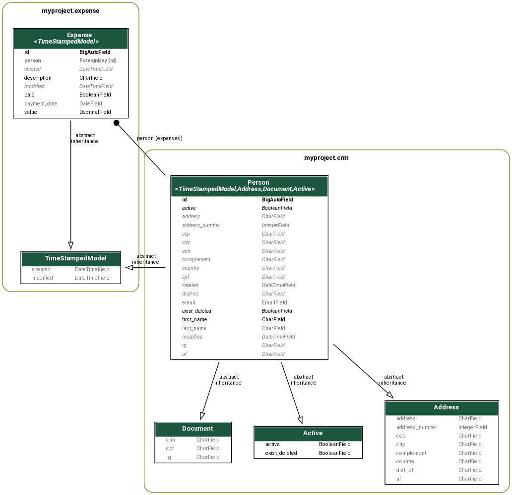

# django-boilerplate

#### Boilerplate to create Django project.

This boilerplate creates a simple Django project with a core app and some pre-defined settings.

The project contains:

* Settings config
* App Accounts
    * login
    * logout
    * signup



* App CORE
    * Abstract models
* App CRM
    * CRUD
    * Templates
* App Expense
    * CRUD
    * Templates
    * Modal
    * [htmx](https://htmx.org/)




CRM Model


## Packages

Packages used in conjunction with Django.

* [Python 3.12](https://www.python.org/downloads/)
* [Django 5.1.*](https://www.djangoproject.com/)
* [dj-database-url](https://pypi.org/project/dj-database-url/)
* [django-extensions](https://django-extensions.readthedocs.io/en/latest/installation_instructions.html)
* [django-localflavor](https://pypi.org/project/django-localflavor/)
* [isort](https://pypi.org/project/isort/)
* [python-decouple](https://pypi.org/project/python-decouple/)
* [django-seed](https://github.com/Brobin/django-seed)
* [htmx](https://htmx.org/)

## Usage

This script run in **Unix**.

```
git clone https://github.com/rg3915/django-boilerplate.git /tmp/django-boilerplate
# Copy this file to your actual folder.
cp /tmp/django-boilerplate/boilerplatesimple.sh .
```

Update USERNAME to your username.

Type the following command. You can change the project name.

```
source boilerplatesimple.sh myproject
```


### Alias

If yout want to use a alias.

```
alias djboilerplate='git clone https://github.com/rg3915/django-boilerplate.git /tmp/django-boilerplate;
cp /tmp/django-boilerplate/boilerplatesimple.sh .
printf "Type:\n`tput setaf 2`source boilerplatesimple.sh myproject\n"'
```

### App CRM

CRM example.

```
python manage.py create_data
python manage.py runserver
```

### App Expense

Example of a simple expense.

Exploring Boostrap modal and [htmx](https://htmx.org/).

### New app

If create new app edit `*/apps.py`.


```python
# accounts/apps.py
# core/apps.py
# crm/apps.py
# expense/apps.py
name = 'PROJECT.<app name>'
# example
name = 'myproject.accounts'
name = 'myproject.core'
name = 'myproject.crm'
name = 'myproject.expense'
```

### django-seed

To populate database with fake data, use [django-seed](https://github.com/Brobin/django-seed) and type

```
python manage.py seed crm expense --number=15
```

### Base Models

The app core contains abstract models to use in other models.


### management commands

The app core contains a management commands example.

```
$ python manage.py hello --help

usage: manage.py hello [-h] [--awards] ...

Print hello world.

optional arguments:
  -h, --help            show this help message and exit
  --awards, -a          Help of awards options.
```

```
$ python manage.py create_data --help

usage: manage.py create_data [-h] ...

Create data.
```

### Graphic model Django with PyGraphViz

```
sudo apt-get install -y graphviz libgraphviz-dev pkg-config
python3 -m venv .venv
source .venv/bin/activate
pip install -r requirements.txt
pip install pygraphviz
pip uninstall pyparsing
pip install -Iv https://pypi.python.org/packages/source/p/pyparsing/pyparsing-1.5.7.tar.gz#md5=9be0fcdcc595199c646ab317c1d9a709
pip install pydot
pip install django-extensions
```


The next command generate the graphic of model.

```
python manage.py graph_models -e -g -l dot -o core.png core  # only app core
python manage.py graph_models -a -g -o models.png  # all
```


## Screen







### Folders

```
.
.
├── contrib
│   └── env_gen.py
├── manage.py
├── myproject
│   ├── asgi.py
│   ├── accounts
│   │   ├── admin.py
│   │   ├── apps.py
│   │   ├── forms.py
│   │   ├── models.py
│   │   ├── templates
│   │   │   └── accounts
│   │   │       ├── login.html
│   │   │       └── signup.html
│   │   ├── tests.py
│   │   ├── urls.py
│   │   └── views.py
│   ├── core
│   │   ├── admin.py
│   │   ├── apps.py
│   │   ├── management
│   │   │   └── commands
│   │   │       ├── create_data.py
│   │   │       ├── hello.py
│   │   │       └── __init__.py
│   │   ├── models.py
│   │   ├── static
│   │   │   ├── css
│   │   │   │   ├── form.css
│   │   │   │   ├── icons
│   │   │   │   │   └── simple-line-icons.min.css
│   │   │   │   ├── login.css
│   │   │   │   └── style.css
│   │   │   ├── fonts
│   │   │   │   ├── Simple-Line-Icons.eot
│   │   │   │   ├── Simple-Line-Icons.svg
│   │   │   │   ├── Simple-Line-Icons.ttf
│   │   │   │   ├── Simple-Line-Icons.woff
│   │   │   │   └── Simple-Line-Icons.woff2
│   │   │   └── img
│   │   │       └── django-logo-negative.png
│   │   ├── templates
│   │   │   ├── base.html
│   │   │   ├── base_login.html
│   │   │   ├── includes
│   │   │   │   ├── nav.html
│   │   │   │   └── pagination.html
│   │   │   └── index.html
│   │   ├── tests.py
│   │   ├── urls.py
│   │   └── views.py
│   ├── crm
│   │   ├── admin.py
│   │   ├── apps.py
│   │   ├── forms.py
│   │   ├── mixins.py
│   │   ├── models.py
│   │   ├── templates
│   │   │   └── crm
│   │   │       ├── person_confirm_delete.html
│   │   │       ├── person_detail.html
│   │   │       ├── person_form.html
│   │   │       └── person_list.html
│   │   ├── tests.py
│   │   ├── urls.py
│   │   └── views.py
│   ├── expense
│   │   ├── admin.py
│   │   ├── apps.py
│   │   ├── forms.py
│   │   ├── mixins.py
│   │   ├── models.py
│   │   ├── templates
│   │   │   └── expense
│   │   │       ├── expense_detail.html
│   │   │       ├── expense_form.html
│   │   │       ├── expense_list.html
│   │   │       ├── expense_result.html
│   │   │       ├── expense_table.html
│   │   │       ├── expense_update_form.html
│   │   │       └── includes
│   │   │           ├── add_modal.html
│   │   │           ├── detail_modal.html
│   │   │           └── update_modal.html
│   │   ├── tests.py
│   │   ├── urls.py
│   │   └── views.py
│   ├── settings.py
│   ├── urls.py
│   ├── utils
│   │   ├── progress_bar.py
│   │   └── utils.py
├── README.md
└── requirements.txt
```
